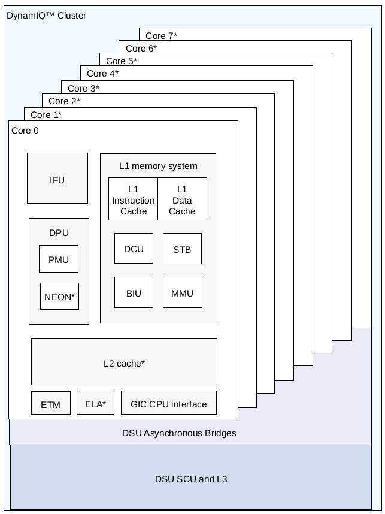
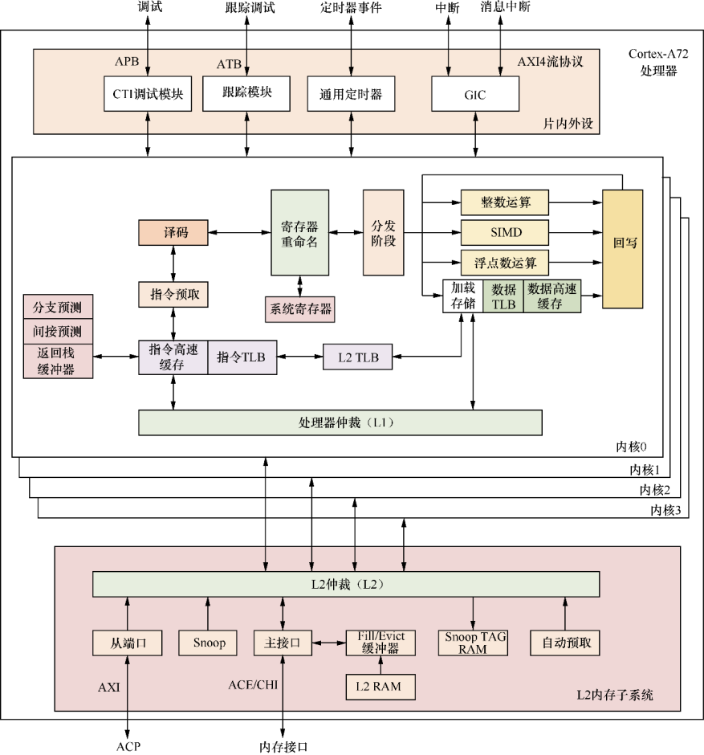
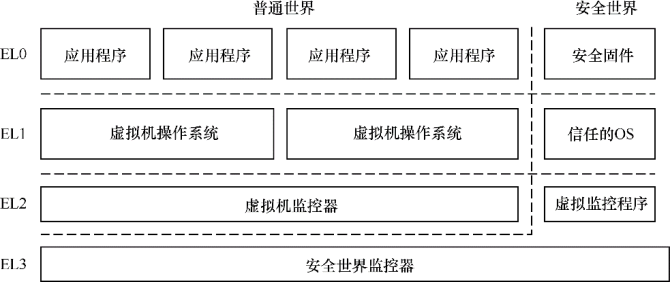
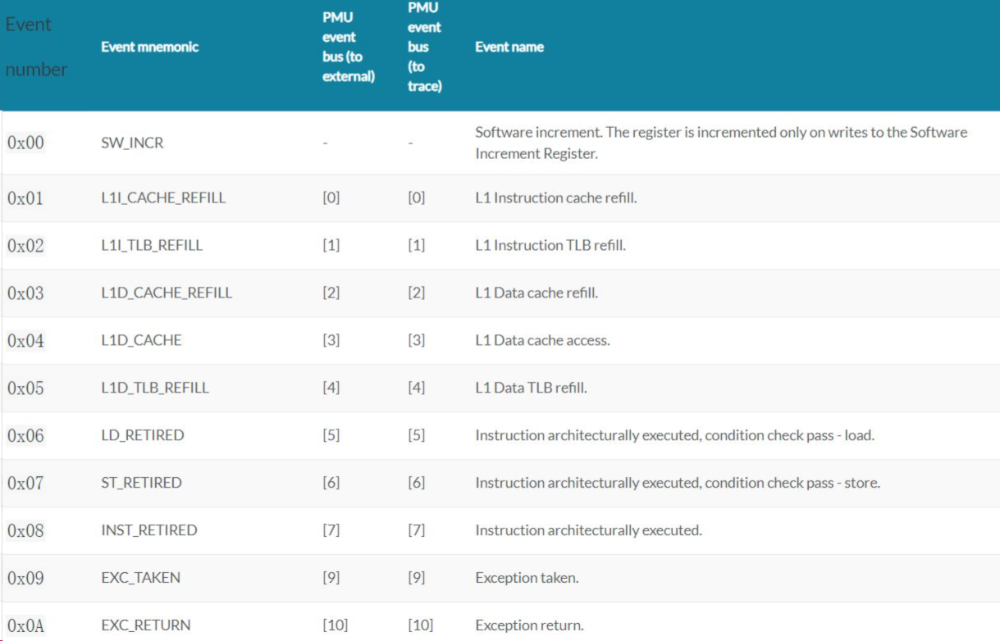
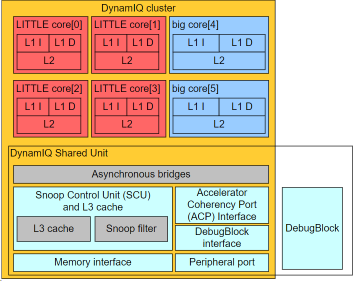

# 1. 介绍

## Features

**Core Features**

* Arm®v8.2-A A64, A32, and T32指令集完整实现
* 所有异常级别(EL0 to EL3)支持aarch32和aarch64执行状态
* 直接和间接分支预测的有序流水线
* MMU
* TrustZone
* SIMD和浮点架构(可选)
* 加密扩展(可选)
* Generic Interrupt Controller interface，支持外部中断分配器, 8366使用的中断控制器为GIC-600
* Generic Timer interface，支持64位计数器，可连接外部系统计数器，外部计数器提供时钟中断并向所有core广播计数

**Cache Features**

* L2 Cache(可选)
* L1 Cache保护，ECC or parity

**Debug features**

* Reliability, Availability, and Serviceability (RAS)扩展，一套错误处理框架
* Arm®v8.2-A debug logic
* Performance Monitoring Unit (PMU)
* Embedded Trace Macrocell (ETM) ，只支持指令追踪

## 总览

cortex a55 core集群由1-8个core，DynamIQ™ Shared Unit (DSU)组成


**NEON(SIMD)
Embedded Trace Macrocell (ETM)<Debug&Trace>
Embedded Logic Analyzer (ELA)<Debug&Trace>
Snoop Control Unit (SCU)<Cache一致性>**
**Instruction Fetch Unit (IFU)**
从cache或内存取指并做分支预测，把指令传给DSU
**Data Processing Unit (DPU)**
解码和执行指令，执行指令过程中和内存的数据传输通过DCU完成，DPU包含PMU， 高级SIMD和浮点，加密扩展
**Performance Monitor Unit (PMU)**
包含6个性能监视器，可被配置用于收集统计每个core和内存系统的操作，用户调试和优化
**Memory Management Unit (MMU)**
MMU通过虚地址物理地址映射和翻译表中的内存属性提供细粒度内存控制。一个表项被使用后会缓存到Translation Lookaside Buffer (TLB)。
TLB表项包含Address Space Identifiers (ASIDs)避免进程调度flush TLB，TLB表项同时包含Virtual Machine Identifiers (VMIDs)避免虚拟机切换flush TLB

```
L1 TLBs
分为指令TLB和数据TLB
L2 TLB
统一的TLB，类似L2 Cache，可以通过使能single-bit error检测来cache保护
```

**L1 memory system**
包含Data Cache Unit (DCU), the Store Buffer (STB), and the Bus Interface Unit (BIU)
**DCU**
DCU管理所有load和store操作，L1 cache通过ECC保护数据，ECC scheme是单比特错误纠正双比特错误检测。
DCU 包括一个组合的本地和Load-Exclusive 和 Store-Exclusive 指令使用的全局独占监视器。
**STB**
Store Buffer
STB持有已经DPU内离开load/store流水线并且被DPU提交的store操作。STB可以访问L1 data cache，新加入填充的行，或者写L2,L3。
STB还用于在广播到cluster其他core之前对操作排队。
**BIU**
BIU包含连接L2 Cache的接口和buffer，用于分离L1 data和STB。
**L2 memory system(可选)**
**GIC CPU interface**
GIC CPU 接口与外部分发器组件集成时，是用于支持和管理集群系统中的中断的资源。
**DynamIQ™ Shared Unit**
DSU包含L3 cache并维护集群core之间的一致性。[详情](https://developer.arm.com/documentation/100453/latest/)
**Debug and trace components**
cortex-a55包含一系列调试，测试，追踪操作：

* 6个事件计数器，由PMU提供，一个循环计数器
* 6个硬件breakpoints，4个watchpoints
* Per-core指令追踪(ETM)
* Per-core支持ELA-500(嵌入式逻辑分析仪，调试用)
* AMBA 4 APB接口支持core cluster和DebugBlock
  [更多细节](https://developer.arm.com/documentation/100453/latest/)

## A72内部结构




## 异常等级



## PMU



## DSU


