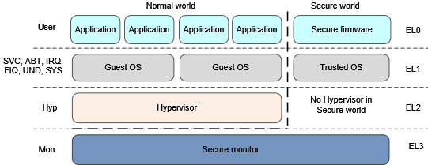
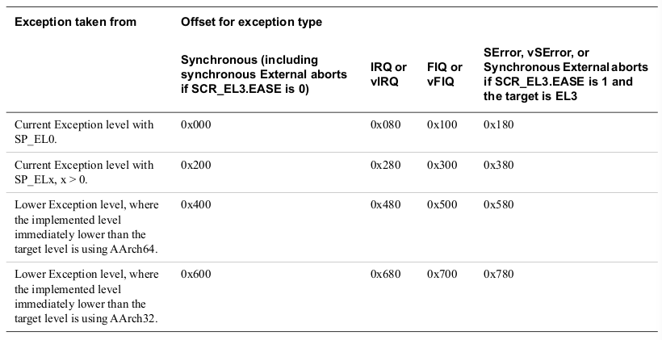
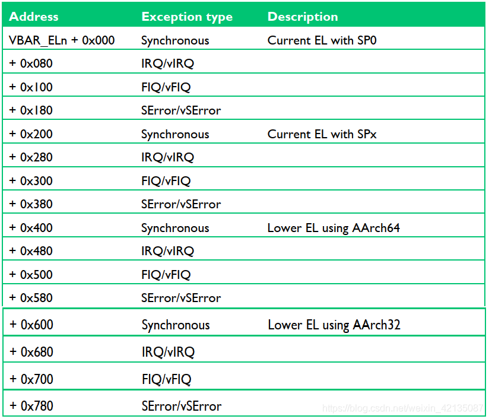

# 10.异常和中断处理

## Interrupt
一般有两种，分为 irq 和 fiq。fiq 的优先级高于 IRQ，这两种异常通常都与内核上的输入引脚相关。假设中断未被禁用，外部硬件assert了一个中断请求并在当前指令完成执行时触发相应的异常类型（irq or fiq),fiq 和 irq对 core 来说都是物理信号，当被assert时，如果内核当前已启用，则会发生相应的异常。在几乎所有系统上，各种中断源都使用中断控制器连接。中断控制器对中断进行仲裁并确定其优先级，进而提供串行化的单个中断信号，然后将其连接到内核的 FIQ 或 IRQ 信号。
## Aborts
在指令获取失败或数据访问失败时生成Abort。它可来源于内存访问错误时的外部内存系统（可能表明指定的地址与系统中的实际内存不对应）。也可来源于 core 内的内存管理单元 (MMU) 生成Abort。操作系统可以使用 MMU Abort来为应用程序动态分配内存。
比如未定义指令触发Abort，比如写了只读内存页触发Abort，反映在应用层是段错误。操作系统的COW机制，利用内存异常延迟分配内存。
## Reset
复位被视为最高异常级别的特殊向量。
这是 ARM 处理器在触发异常时的指令跳转位置。这个向量使用 IMPLEMENTATION DEFINED 地址。RVBAR_ELn 包含此复位向量地址，其中 n 是实现的最高异常级别的编号。所有内核都有一个复位输入，并在复位后立即发生复位异常。它是最高优先级的异常，不能被屏蔽。此异常用于在上电后在内核上执行代码以对其进行初始化。
arm64 reset，不再存在exception handler，发生reset后跳转RVBAR_EL3寄存器保存的地址执行，该寄存器会预设地址，启动后可修改。cold reset执行预设地址代码，warm reset执行修改后地址代码。
## 生成异常的指令
执行某些指令会产生异常。通常执行此类指令可以从运行更高权限级别的软件请求服务：
• Supervisor Call (SVC) 指令可以使用户模式程序能够请求操作系统（OS）服务。
• Hypervisor Call (HVC) 指令使客户操作系统（guest OS）能够请求管理程序服务。
• Secure monitor Call（安全监控 SMC) 指令使非安全世界请求安全世界服务。

如果异常是由于在 EL0 处取指令而产生的，则将其视为 EL1 的异常，除非 HCR_EL2.TGE(这个寄存器和虚拟化相关) 位设置为非安全状
态，在这种情况下将其视为 EL2。如果异常是由于任何其他异常级别的指令提取而生成的，则异常级别保持
不变。
## 同步和异步中断
同步异常类型：
| 异常类型    |  描述   |
| :-- | :-- |
| Undefined Instruction    | 未定义指令异常    |
|  Illegal Execution State   | 非法执行状态异常    |
| System Call    | 系统调用指令异常（SVC/HVC/SMC）    |
| Misaligned PC/SP    | PC/SP未对齐异常    |
| Instruction Abort    |  指令abort异常   |
| Data Abort    |  数据abort异常   |
| Debug exception    | 软件断点指令/断点/观察点/向量捕获/软件单步 等Debug    |

异步异常类型：
| 类型    | 描述   |
| :-- | :-- |
| SError or vSError    | 系统错误类型，包括外部数据终止    |
|  IRQ or vIRQ   | 外部中断 or 虚拟外部中断    |
| FIQ or vFIQ    | 快速中断 or 虚拟快速中断    |

## aarch64异常向量表
当异常发生时，处理器必须执行与异常对应的处理程序代码。 存储处理程序的内存位置称为异常向量。 在 ARM 体系结构中，异常向量存储在一个表中，称为异常向量表。

- 如果发生异常后并没有exception level切换，并且发生异常之前使用的栈指针是SP_EL0，那么使用第一组异常向量表。
- 如果发生异常后并没有exception level切换，并且发生异常之前使用的栈指针是SP_EL1/2/3，那么使用第二组异常向量表。内核态发生中断。
- 如果发生异常导致了exception level切换，并且发生异常之前的exception level运行在AARCH64模式，那么使用第三组异常向量表。系统调用。
- 如果发生异常导致了exception level切换，并且发生异常之前的exception level运行在AARCH32模式，那么使用第四组异常向量表。32位程序系统调用。

每个异常级别都有自己的向量表，即 **EL3、EL2 和 EL1** 各有一个。 该表包含要执行的指令，而不是一组地址。 个别异常的向量位于表开头的固定偏移量处。 每个表基的虚拟地址由基于向量的地址寄存器 VBAR_EL3、VBAR_EL2,和 VBAR_EL1 设置。

向量表中的每个条目有 16 条指令长。 与每个条目为 4 个字节的 ARMv7 相比，这本身就是一个重大变化。,ARMv7 向量表的这种间距意味着每个条目几乎总是某种形式的分支，指向内存中其他地方的实际异常处理程序。,在 AArch64 中，向量的间距更宽，因此顶层处理程序可以直接写入向量表中。

### 通用中断处理
ARM 提供了用于 ARMv8-A 架构的标准中断控制器。该中断控制器的可编程接口在 GIC 架构中定义。GIC架构规范有多个版本。本文档主要介绍版本 (GICv2)。ARMv8-A 处理器通常连接到 GIC，例如 GIC-400 或GIC-500。通用中断控制器 (GIC) 支持在多核系统中的内核之间路由软件（SPI）生成、私有 (PPI) 和共享的外围中断 (SPI)。

GIC 架构提供的寄存器可用于管理中断源和中断行为，以及在多核系统中将中断路由到各个内核。以使软件能够屏蔽、启用和禁用来自单个源的中断，对（在硬件中）单个源进行优先级排序并生成软件中断。GIC 接受在系统级别断言的中断，并可以向它所连接的每个内核发送信号，从而可能导致发生 IRQ 或 FIQ 异常。

从软件的角度来看，GIC 主要有两个主要的功能块
* Distributor：系统中的所有中断源都连接到 distributor。Distributor 提供寄存器来控制各个中断的属性，例如优先级、状态、安全性、路由信息和启用状态。distributor 通过附加的 CPU 接口确定将哪个中断转发到内核。
* CPU Interface：cpu 通过它接收中断。CPU 接口提供寄存器来屏蔽、识别和控制转发到该内核的中断状态。系统中的每个内核都有一个单独的 CPU 接口。