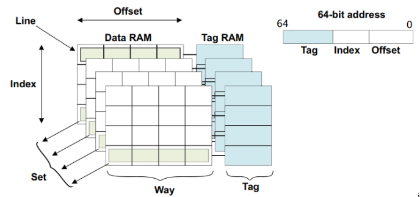
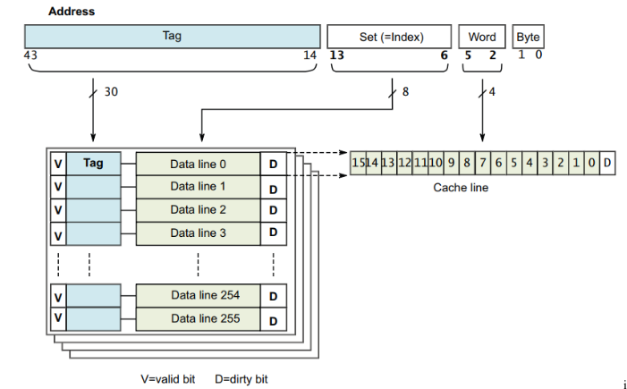
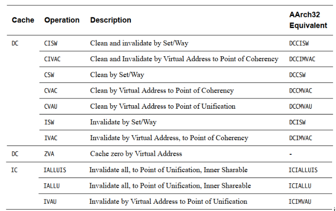
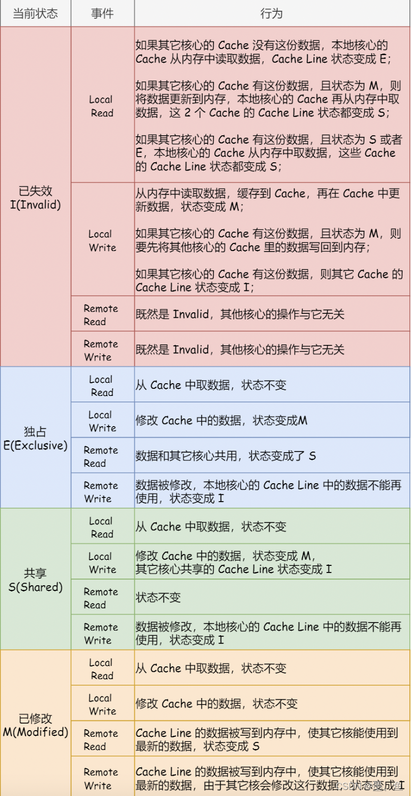
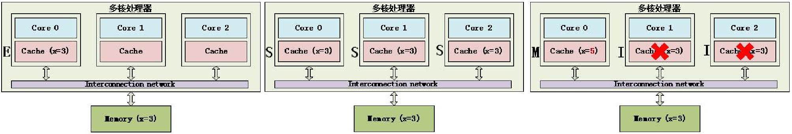
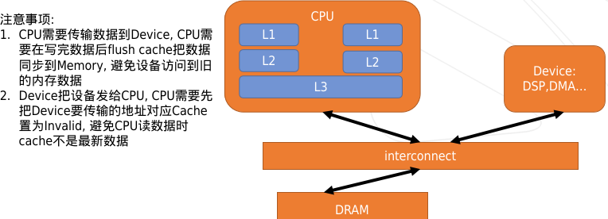
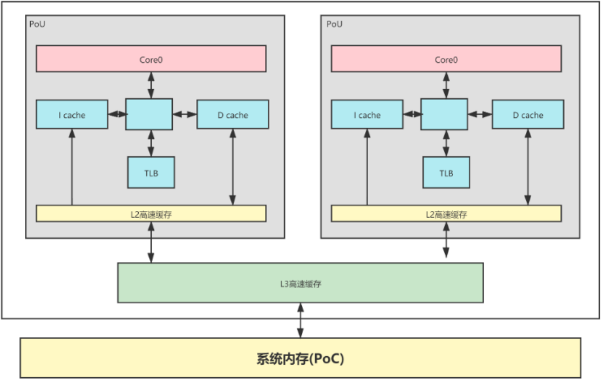
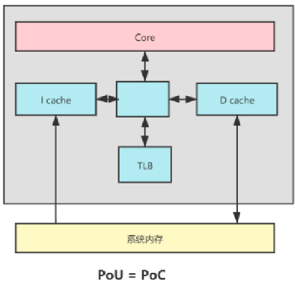
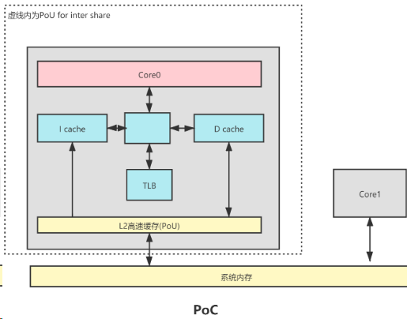

# 11.Cache

## 结构

* Tag是内存地址的一部分，保存在cache并标识和主内存关联的line数据。
  64-bit地址的高位作为Tag，告诉cache数据来源于主内存的什么地方。
* 如果每个Tag只关联一个word数据，很浪费，效率低，所以一个Tag关联主存一块连续内存，称为一个line。
* 相同Index的cache line构成一个set，一个有几个cache line，表示有几个way。
* L2 cache alloc操作只有L1淘汰时才发生,即L2 alloc的数据是L1淘汰的数据

## Tag和物理地址

查询过程：
根据index查找set id，根据tag查找属于set中的哪一个way。
set数量和index最大长度相同，所以根据index查找set复杂度为O(1)。
每个set中way数量最大不超过8，超过8-way性能改进不大但成本增加会很大。
**疑问，每个set的n-way是不是并行查找？**

## 缓存策略

**缓存分配策略**

* Write allocation 写未命中分配缓存行
* Read allocation 读未命中分配缓存行
  **缓存更新策略**
* Write-back 有写入行为讲cache line标记为dirty，当cache line被替换或者明确invalidate才会flush到内存。
* Write-through write操作同时更新cache line和内存，不会标记dirty。

## 缓存操作

* clean 降dirty状态cache line写入主存，并清除dirty标识
* invalidate 只标记cache line无效，不会flush数据

## MESI协议

> 总线嗅探只是保证了某个 CPU 核心的 Cache 更新数据这个事件能被其他 CPU 核心知道，但是并不能保证事务串形化。
>
> SCU组件实现cluster数据一致性

M：这行数据有效，数据已被修改，和内存中的数据不一致，数据只存在于该高速缓存中
E：这行数据有效，数据和内存中数据一致，数据只存在于该高速缓存中
S：这行数据有效，数据和内存中数据一致，多个高速缓存有这行数据的副本
I：这行数据无效

MESI 协议这4 个字母代表4个状态，分别是： Modified（已修改）、Exclusive（独占）、Shared（共享）、Invalidated（已失效）。

### 状态迁移

### CPU Cache & Device数据一致性

## Cache中PoU&PoC

Point of Coherency (PoC) – CPU,DSP,GPU,DMA等可访问memory的设备看到的memory copy是相同的。
Point of Unification (PoU) – 一个core的Icache,Dcache,TLB看到的memory copy是相同的。

