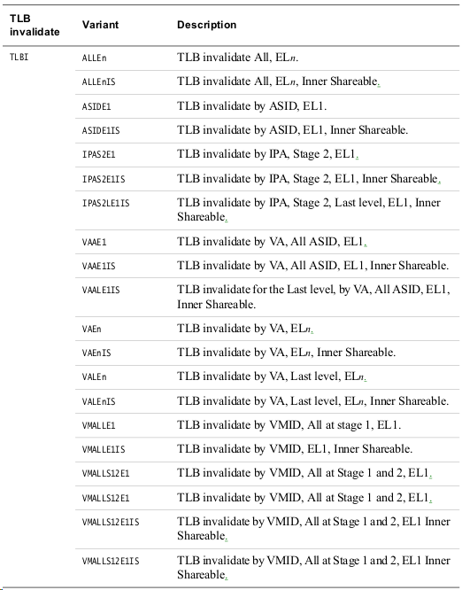
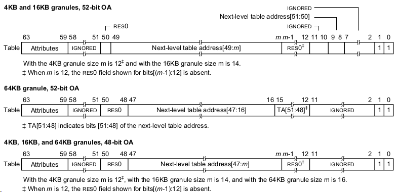
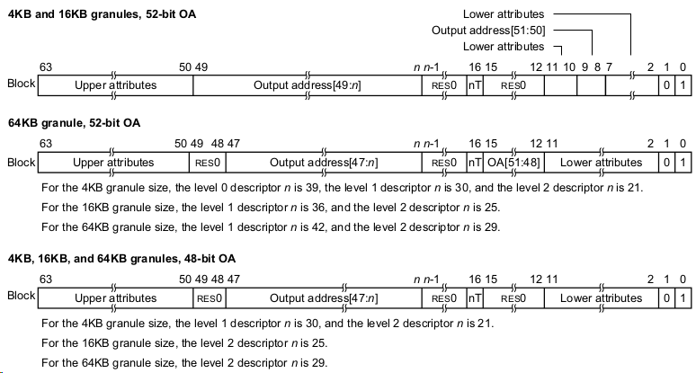
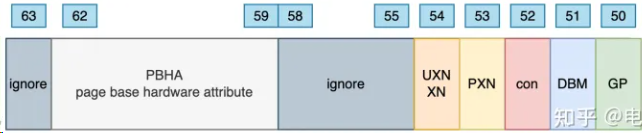
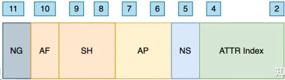
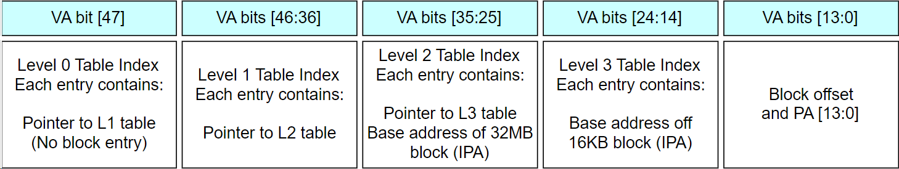
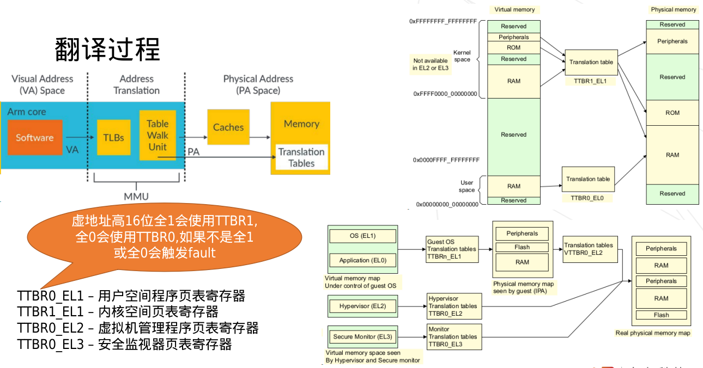

# 3.MMU

## MMU要开的原因

在ARM里，如果不开MMU，不仅不能开启cache，连内存属性都不是normal，而是device，device属性不允许硬件对AXI总线的信号进行合并、乱序等，效率较低。

## Cache组织方式

Memory Management Unit (MMU)职责是把数据和代码的虚地址翻译成物理地址，同时MMU控制内存访问权限，内存访问顺序和cache策略。
L2 TLB支持ASID防止上下文切换TLB flush，TLB entries包含VMID防止虚拟机切换TLB flush。
a55支持40位地址线，最大支持1TB物理内存。(应该是每次16字节)
**全相连 - full associative**

在这种组织方式下，TLB cache中的表项和线性地址之间没有任何关系，也就是说，一个TLB表项可以和任意线性地址的页表项关联。这种关联方式使得TLB表项空间的利用率最大。但是延迟也可能相当的大，因为每次CPU请求，TLB硬件都把线性地址和TLB的表项逐一比较，直到TLB hit或者所有TLB表项比较完成。特别是随着CPU缓存越来越大，需要比较大量的TLB表项，所以这种组织方式只适合小容量TLB。
**组相连 - set-associative**

为了解决全相连内部比较效率低和直接匹配的冲突，引入了组相连。这种方式把所有的TLB表项分成多个组，每个线性地址块对应的不再是一个TLB表项，而是一个TLB表项组。CPU做地址转换时，首先计算线性地址块对应哪个TLB表项组，然后在这个TLB表项组顺序比对。按照组长度，我们可以称之为2路，4路，8路。

经过长期的工程实践，发现8路组相连是一个性能分界点。8路组相连的命中率几乎和全相连命中率几乎一样，超过8路，组内对比延迟带来的缺点就超过命中率提高带来的好处了。

| Component          | Description                         |
| ------------------ | ----------------------------------- |
| Instruction L1 TLB | 15 entries, fully associative       |
| Data L1 TLB        | 16 entries, fully associative       |
| L2 TLB             | 1024 entries, 4-way set associative |
| Walk cache RAM     | 64 entries, 4-way set associative   |
| IPA cache RAM      | 64 entries, 4-way set associative   |

Walk cache RAM: 保存4级页表中的前三个level缓存

IPA cache RAM:   保存虚拟机物理地址到物理机物理地址映射

## TLB组织方式

Translation Lookaside Buffer (TLB)是MMU内部cache，保存最近的page转换操作。
a55支持两级TLB。L2 TLB存储完整的page size，并且负责把大page切成小page提供给L1 data TLB 或者instruction TLB。
TLB不支持lockdown，会自动执行替换操作，reset后所有TLB都会执行invalidate操作。

TLB - Translation Lookaside Buffer
粒度 - 4KB, 16KB, or 64KB for LPAE
ASID – 8-16 bit
VMID – 8-16 bit
PA size – max 40 bit, 1TB

### L1 TLB

L1 instruction TLB支持4KB, 16KB, 64KB, and 2MB 页面大小。
L1 data TLB 只支持4KB页面。

### L2 TLB

处理L1 TLB misses, 支持Virtual Memory System Architecture (VMSA) block sizes，除了1GB。对于1GB block，L2 TLB会拆成512MB的block。
entries分table entries和block entries，每个虚拟机分配的大内存用的block entries。

## TLB Operation

指令格式 TLBI `<type><level>`{IS} {, `<Xt>`}

例子
TLBI ALLE1    // invalidate all TLB entries
TLBI VAE1, X0 // X0放ASID

## Table descriptor

## Bock descriptor

## 页表属性

**Upper attributes**
PBHA
UXN 控制对应页表的内存空间在el0非特权等级状态下是否可以执行代码
PXN 控制对应页表的内存空间在特权等级状态下是否可以执行代码
CON 指示页表执行的地址是否连续、用于与tlb相关的一些优化？
DBM dirty date
GP Guarded Page
**Lower attributes**
nG not global , 配合 ASID 使用，可以使tlb实现局部刷新、提高效率
AF accces flag
SH share
AP 访问权限、主要是读、写
NS 表示页表是安全或非安全，与安全态相关
Attr Index 与mair寄存器配合使用，mair寄存器配置了不同序号对应的内存属性，这里通过序号选择内存属性

## A55 页表粒度

## 翻译过程

