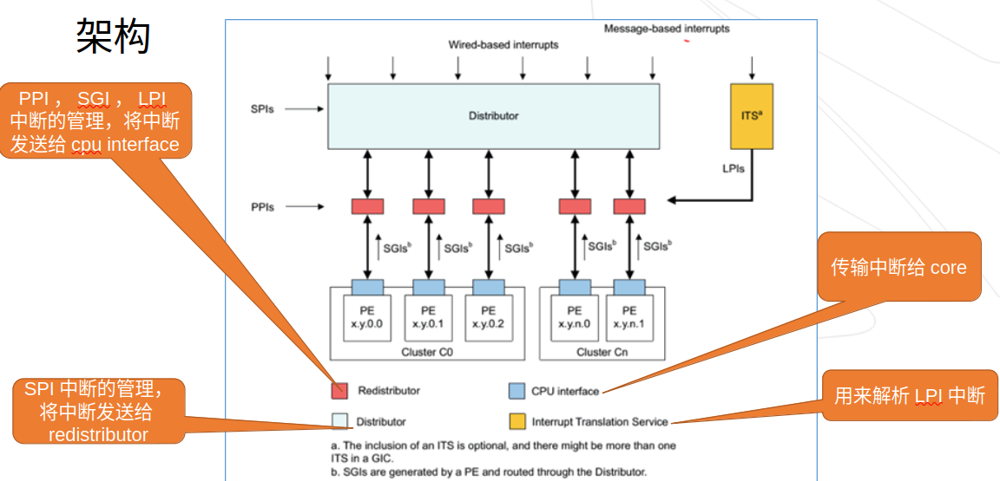

# 5.GIC

Generic Interrupt Controller CPU interface
**GICv4架构支持**：

* 两种安全状态
* 中断虚拟化
* SGI中断
* Message Based中断
* 通过CPU interface访问系统寄存器
* 中断掩码和优先级
* 支持cluster， 包含超过8个core
* 支持电源管理环境唤醒时间
  **GIC中断分组功能**
* 配置每个中断属于某个中断group
* 使用IRQ或者FIQ方式把Group1中断信号发送到目标core
* 只能使用FIQ方式把Group0中断信号发送到目标core
* 用统一方案处理Group0和Group1中断优先级

## 结构图

## 硬件中断类型

SGI (Software Generated Interrupt)：软件触发的中断。软件可以通过写 GICD_SGIR 寄存器来触发一个中断事件，一般用于核间通信，内核中的 IPI：inter-processor interrupts 就是基于 SGI。

PPI (Private Peripheral Interrupt)：私有外设中断。这是每个核心私有的中断。PPI会送达到指定的CPU上，应用场景有CPU本地时钟。

SPI (Shared Peripheral Interrupt)：公用的外部设备中断，也定义为共享中断。中断产生后，可以分发到某一个CPU上。比如按键触发一个中断，手机触摸屏触发的中断。

LPI (Locality-specific Peripheral Interrupt)：LPI 是 GICv3 中的新特性，它们在很多方面与其他类型的中断不同。LPI 始终是基于消息的中断，它们的配置保存在表中而不是寄存器。比如 PCIe 的 MSI/MSI-x 中断
