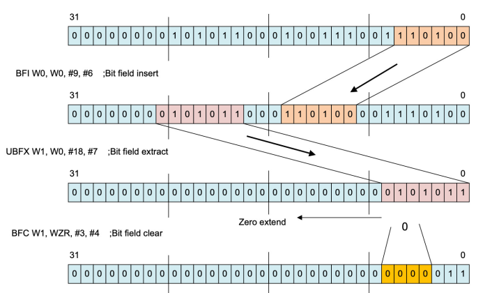
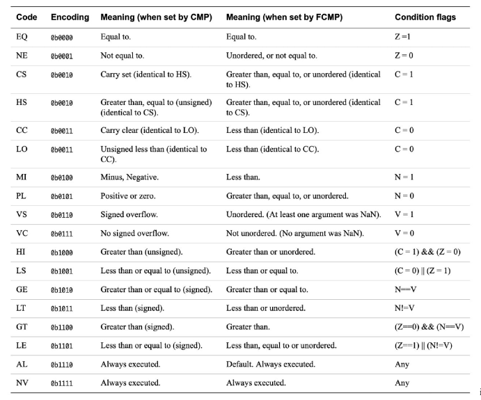
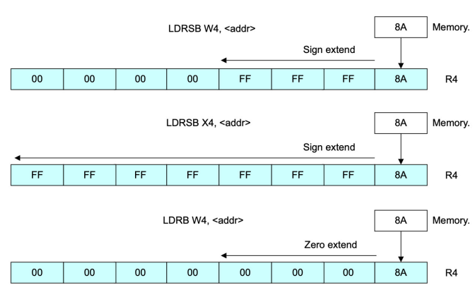
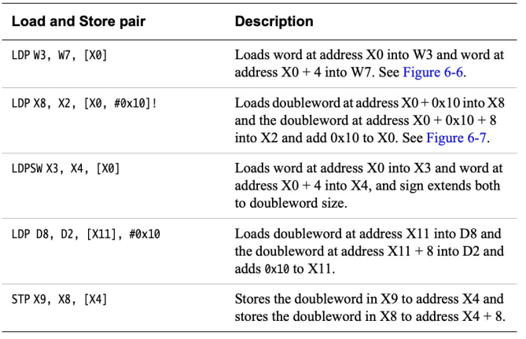
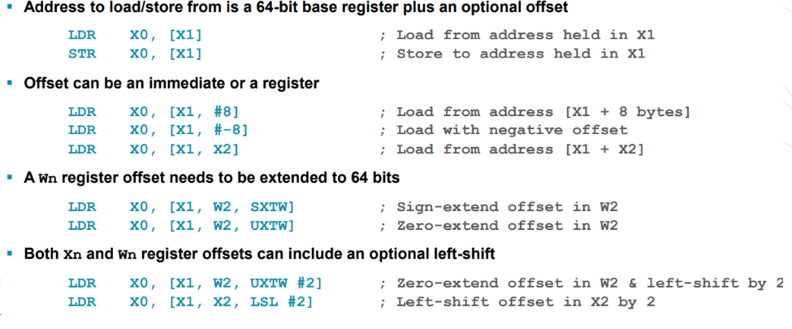
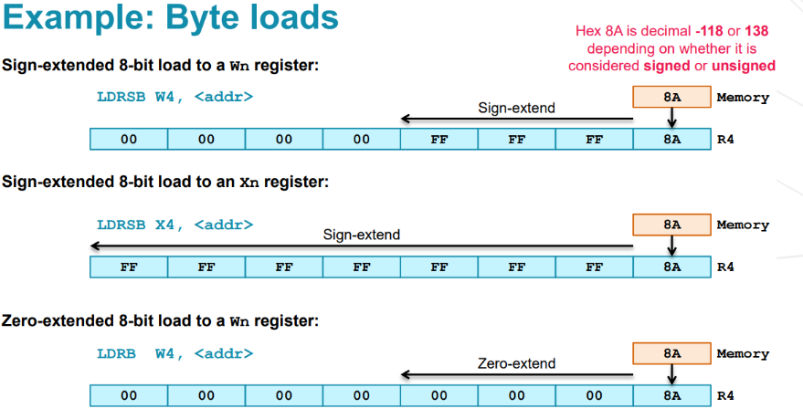
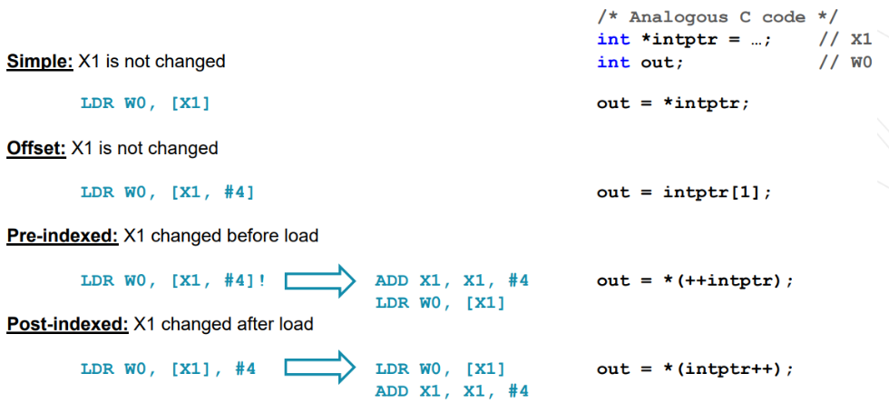
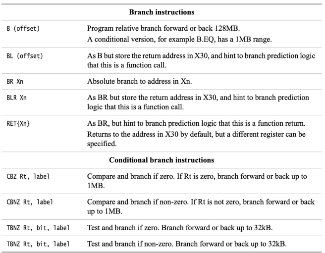

# 8.指令集

字节（byte）：8位。
半字（halfword）：16位。
字（word）：32位。
双字（doubleword）：64位。
四字（quadword）：128位。

## 数据处理指令

数据处理指令大部分有一个目的寄存器和两个源操作数，通用格式如下：

```asm
Instruction Rd, Rn, Operand2
```

数据处理操作包括：

* 算术和逻辑操作
* 传送和移位操作
* 符号扩展和0扩展
* 位和位域处理
* 条件比较和数据处理

### 算术和逻辑操作

| 类型                                                                                    | 指令                         |
| :-------------------------------------------------------------------------------------- | :--------------------------- |
| 算术                                                                                    | ADD, SUB, ADC, SBC, NEG      |
| 逻辑                                                                                    | AND, BIC, ORR, ORN, EOR, EON |
| 比较                                                                                    | CMP, CMN, TST                |
| 传送                                                                                    | MOV, MVN                     |
| 有些指令包含 S 后缀，这些指令可能会影响到PSTSTE寄存器里面的条件标志位，比如进位、溢出。 |                              |
| 这些指令包括ADDS, SUBS, ADCS, SBCS, ANDS, and BICS.                                     |                              |
| 还有一些会影响到标志位的指令没有 S 后缀，CMP, CMN and TST。                             |                              |
| ADC, SBC 指令和ADD，SUB指令不同的地方在于会把进位标志作为输入带上， 如下：              |                              |

```asm
ADC{S}: Rd = Rn + Rm + C
SBC{S}: Rd = Rn - Rm - 1 + C
```

算术指令例子：

```
ADD W0, W1, W2, LSL #3    // W0 = W1 + (W2 << 3)
SUBS X0, X4, X3, ASR #2    // X0 = X4 - (X3 >> 2), set flags
MOV X0, X1    // Copy X1 to X0
CMP W3, W4    // Set flags based on W3 - W4
ADD W0, W5, #27    // W0 = W5 + 27
```

### 乘法除法指令

基本乘法指令 MUL， 乘法指令包含很多变种。

```asm
MUL X0, X1, X2    // X0 = X1 * X2
```

除法指令UDIV， SDIV，分别为无符号和有符号除法。
除0问题，x86下会抛除0异常，但是arm64会返回0。

### 移位操作

以下说明是专门针对位移的：

* 逻辑向左移位（LSL）。LSL 指令执行 2 的乘法。
* 逻辑向右移位（LSR）。LSR 指令以 2 的幂执行除法。
* 算术向右移（ASR）。ASR 指令执行 2 的幂的除法，保留符号位。
* 循环右移（ROR）。ROR 指令执行后左端空出来的bit用右端移走的bit填充。

### bitfield和字节操作指令

典型bitfield指令：


### 条件指令


有些指令会改变PSTATE寄存器状态位。


## 内存访问指令

ARMv8 架构是一个加载/存储架构。这意味着没有数据处理指令直接对内存中的数据进行操作。数据必须首先被加载到寄存器中，进行修改，然后存储到内存中。程序必须指定一个地址，要传输的数据大小，以及一个源寄存器或目标寄存器。还有一些额外的加载和存储指令，提供了更多的选择，如非时间性的加载/存储，加载/存储排他性，以及获取/释放。
内存指令可以以非对齐方式访问普通内存。这不支持独占访问、加载获取或存储释放变体。如果不需要非对齐访问，可以将其配置为故障。
atomic load store指令必须是对齐的。

### load指令

Load 指令的一般形式如下：

```asm
LDR Rt, <addr>
```

对于加载到整数寄存器中，你可以选择一个大小来加载。例如，要加载一个比指定的寄存器值小的尺寸，在
LDR 指令中加入以下后缀之一：

* LDRB (8-bit, zero extended).
* LDRSB (8-bit, sign extended).
* LDRH (16-bit, zero extended).
* LDRSH (16-bit, sign extended).
* LDRSW (32-bit, sign extended).
  符号扩展规则：
  

### store指令格式

store指令一般形式：

```asm
STR Rn，<addr>
```

### 访问多个内存位置

LDP、STP指令：


### Load Store例子



### 符号扩展和0扩展



### 寻址方式



## 流程控制

A64 指令集提供了许多不同种类的分支指令。对于简单的相对分支，即那些从当前地址开始的偏移量，使用 B 指令。无条件的简单相对分支可以从当的程序计数器位置向后或向前分支，最多可达 128MB。有条件的简单相对分支，即在 B 指令上附加了一个条件代码，其范围较小，为 ±1MB。
对子程序的调用，如果需要将返回地址保存在链接寄存器（X30）中，则使用 BL 指令。这条指令没有条件版本。BL 的行为和 B 指令一样，有一个额外的效果，就是将返回地址，也就是 BL 后的指令地址，存储在寄存器 X30 中。


## 系统控制和其他指令

### 异常处理指令

有三条异常处理指令，其目的是导致异常的发生。这些指令用于调用运行在操作系统（EL1）、管理程序（EL2）或安全监控器（EL3）中更高的异常级别的代码：

* SVC #imm16 //主管调用，允许应用程序调用内核//（EL1）。
* HVC #imm16 //虚拟机管理程序调用，允许操作系统代码调用虚拟机管理程序（EL2）。
* SMC #imm16 //安全监视器调用，允许操作系统或虚拟机管理程序调用安全//监视器（EL3）。

### 系统寄存器访问

系统寄存器访问提供了两项说明：

* MRS Xt,
  例如：MRS X4, ELR_EL1 // Copies ELR_EL1 to X4
* MSR , Xt
  例如：MSR SPSR_EL1, X0 // Copies X0 to SPSR_EL1
  PSTATE 的个别字段也可以用 MSR 或 MRS 访问。例如，要选择与 EL0 相关的堆栈指针或当前的异常级别。
* MSR SPSel, #imm // A value of 0 or 1 in this register is used to select // between using EL0 stack pointer or the current exception
  // level stack pointer
  这些指令有特殊形式可用于清除或设置单个异常掩码位（见第 4-5 页的保存进程状态寄存器）：
* MSR DAIFClr, #imm4
* MSR DAIFSet, #imm4

### 调试指令

有两个与调试相关的说明：

* BRK #imm16 // 进入监视器模式调试，其中有片上调试监视器代码
* HLT #imm16 // 进入停止模式调试，其中连接外部调试硬件
