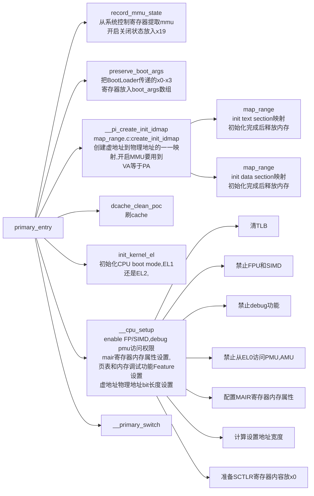
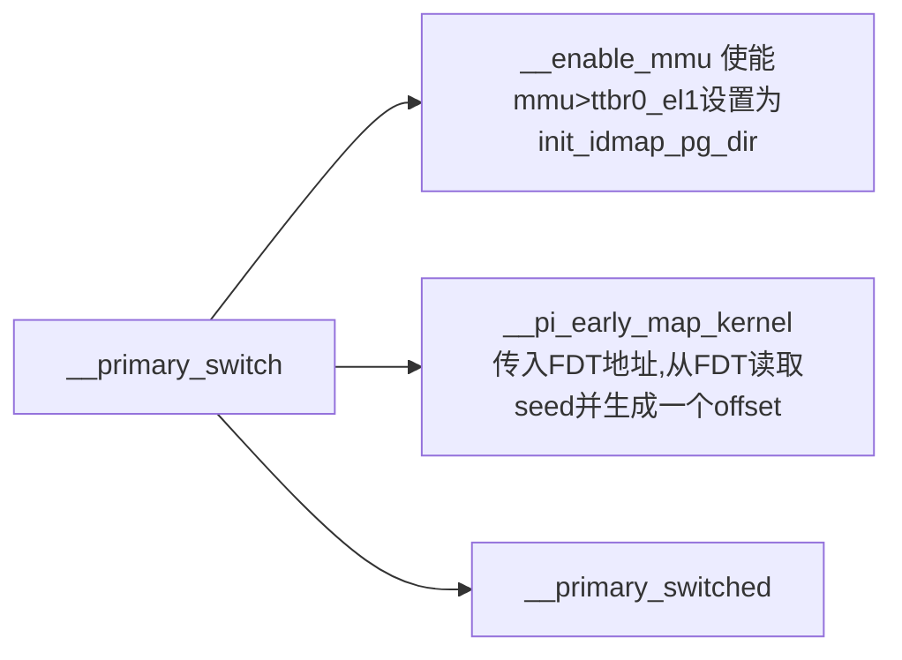
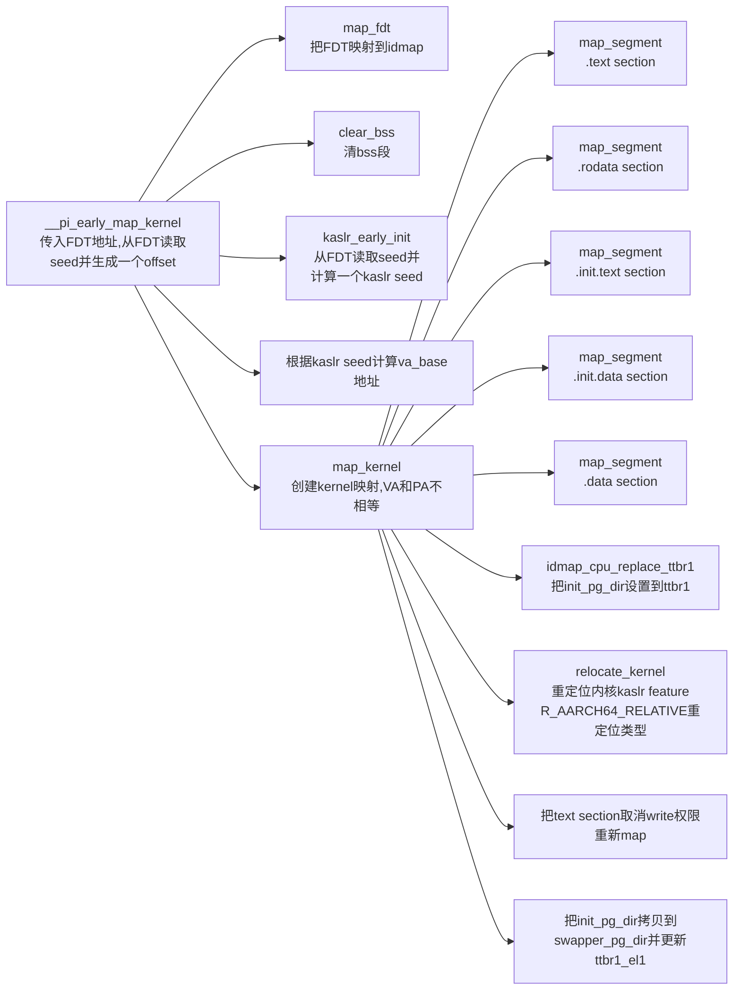
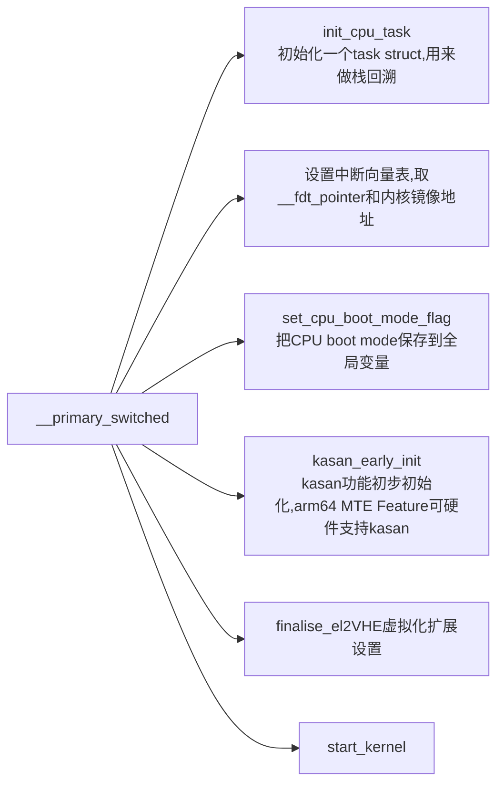

# 页表

**idmap_pg_dir**是identity mapping使用的页表， 从CPU启动会用到， 部分其他功能也会用到。
**swapper_pg_dir**是kernel image mapping最终使用的页表。pgd地址默认初始化为这个值。

**init_idmap_pg_dir**是**Root Level**的identity mapping全局页表，会加载到页表寄存器。

**init_pg_dir**高地址全局页表，临时的内核页表，加载到ttbr1_el1，会被swapper_pg_dir替换。

请注意，这里的内存是一段连续内存。也就是说页表（PGD/PUD/PMD）都是连在一起的，地址相差PAGE_SIZE（4k）。
identity mapping主要是打开MMU的过度阶段，因此对于identity mapping不需要映射整个kernel，只需要映射操作MMU代码相关的部分。这段代码是利用linux中常用手段自定义代码段，自定义的代码段的名称是".idmap.text"。除此之外，肯定还需要在链接脚本中声明两个标量，用来标记代码段的开始和结束。可以从vmlinux.lds.S中找到答案。

```ld
    . = ALIGN(SZ_4K);  
    __idmap_text_start = .;  
    *(.idmap.text)  
    __idmap_text_end = .;
```

# head.S启动过程



# head.S启动子流程

## __primary_switch 流程



### early map kernel



### _primary_switched流程

