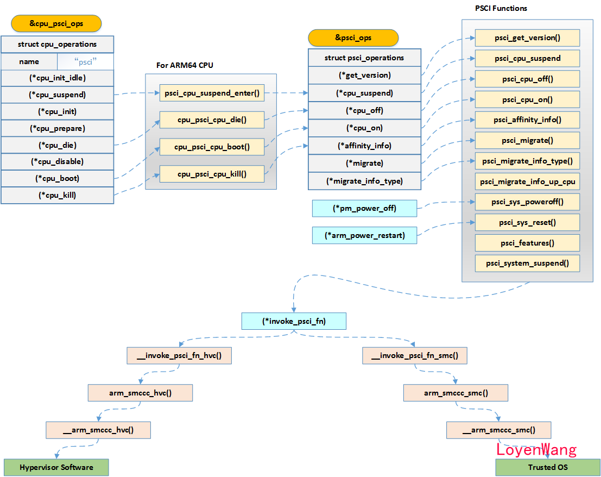

**arm64 linux SMP启动secondary core有两种方式：**

<mark>spin-table和psci</mark>

**spin-table**

        在启动的过程中，bootloader中有一道栅栏，它拦住了除了cpu0外的其他cpu。cpu0直接往下运行，进行设备初始化以及运行Linux Kernel。其他cpu0则在栅栏外进入睡眠状态。cpu0在初始化smp的时候，会在cpu-release-addr里面填入一个地址并唤醒其他 cpu。这时候，在睡眠的这个cpu接受到了信号，醒来的时候先检查下cpu-release-addr这个地址里面的数据是不是不等于0。如果不等于 0，意味着主cpu填入了地址，该它上场了。它就会直接填入该地址执行。

在arch/arm64/boot/dts/xxx.dts中有如下描述：

```
                cpu@0 {
                        device_type = "cpu";
                        compatible = "arm,armv8";
                        reg = <0x0 0x0="">;
                        enable-method = "spin-table";
                        cpu-release-addr = <0x0 0x8000fff8="">;
                };
```

在arch/arm64/kernel/smp_spin_table.c中有相关的处理, 怎么给其他cpu发信号，关注一下下面函数中的几行关键代码：

```c
static int smp_spin_table_cpu_prepare(unsigned int cpu)
{
    __le64 __iomem *release_addr;
    phys_addr_t pa_holding_pen = __pa_symbol(secondary_holding_pen);

    if (!cpu_release_addr[cpu])
        return -ENODEV;

    release_addr = ioremap_cache(cpu_release_addr[cpu],
                     sizeof(*release_addr));
    if (!release_addr)
        return -ENOMEM;

    writeq_relaxed(pa_holding_pen, release_addr);
    dcache_clean_inval_poc((__force unsigned long)release_addr,
                (__force unsigned long)release_addr +
                    sizeof(*release_addr));

    sev();

    iounmap(release_addr);

    return 0;
}
```

> 上述步骤：
> 
> 1. 把secondary core要启动跳转的地址转换成物理地址 pa_holding_pen，secondary core将会跳转到这个地址执行，转成物理地址的原因是secondary core没有启动mmu；
> 
> 2. 把检查地址转成虚地址，因为core0已经开启mmu；
> 
> 3. core0需要把上面的跳转地址写入secondary core检查的位置，这些core发现跳转地址非0就会执行；
> 
> 4. flush cache并唤醒secondary core；
> 
> 5. unmap刚才的虚地址。

bootloader中secondary cpu执行指令：

```asm
        /*  
         * Secondary CPUs  
         */  
1:      wfe  
        ldr     x4, mbox  
        cbz     x4, 1b  
        br      x4                              // branch to the given address
```

**PSCI(Power State Coordination Interface)**

`   PSCI, Power State Coordination Interface`，由ARM定义的电源管理接口规范，通常由Firmware来实现，而Linux系统可以通过`smc/hvc`指令来进入不同的`Exception Level`，进而调用对应的实现。

        设备树文件dts中cpu节点选择psci的method：

```dts
        cpucl0_0: cpu@0 {
                device_type = "cpu";
                compatible = "arm,cortex-a72";
                reg = <0x0 0x000>;
                enable-method = "psci";
                clock-frequency = <2400000000>;
                cpu-idle-states = <&CPU_SLEEP>;
                i-cache-size = <0xc000>;
                i-cache-line-size = <64>;
                i-cache-sets = <256>;
                d-cache-size = <0x8000>;
                d-cache-line-size = <64>;
                d-cache-sets = <256>;
                next-level-cache = <&cpucl_l2>;
        };
```

        Linux对CPU core的操作抽象出了结构`struct cpu_operations`，开放给上层软件调用，`struct cpu_operations`统一对底层的CPU及power等资源进行统一操作。



> - `cpu_psci_ops`中的函数指针在`arch/arm64/kernel/psci.c`中进行赋值，而实际的实现中去调用了`psci_ops`中的实现；
> - `psci_ops`中会根据实际的Function ID找到对应的函数，从而通过`hvc/smc`指令调用Firmware接口；  
>   说一个实际的用例吧：  
>   比如你现在需要把系统Suspend，在用户输入`echo mem > /sys/power/state`，最终会调用到`cpu_suspend`函数，由上图可知，最终也能调用到底层的Firmware，当然，前提是Firmware中已经实现了该接口。
> 
> 所以，现在看起来PSCI其实就是去实现调用底层Firmware的接口，并且填充到对应的数据结构中就行了。
