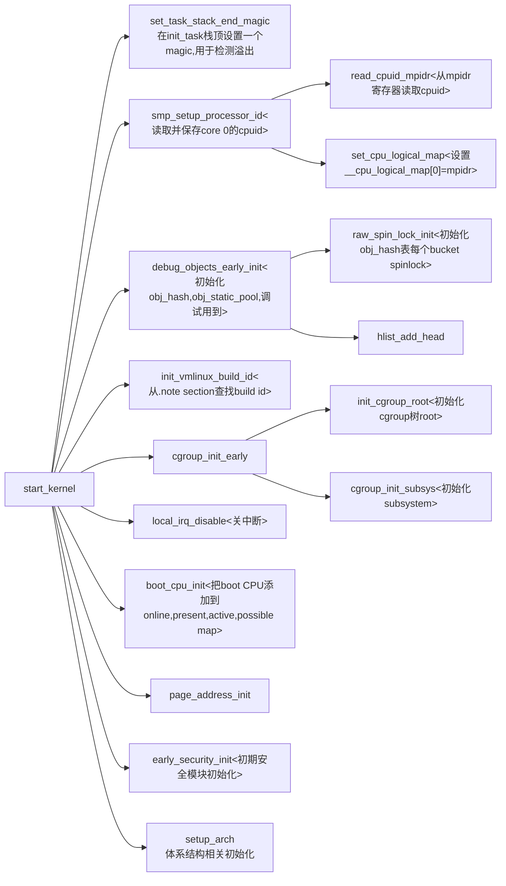
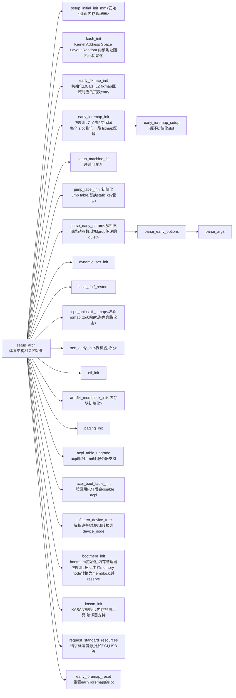
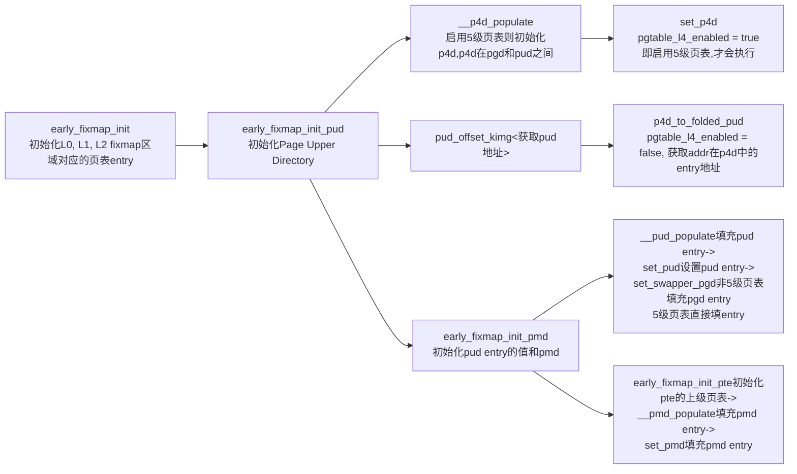
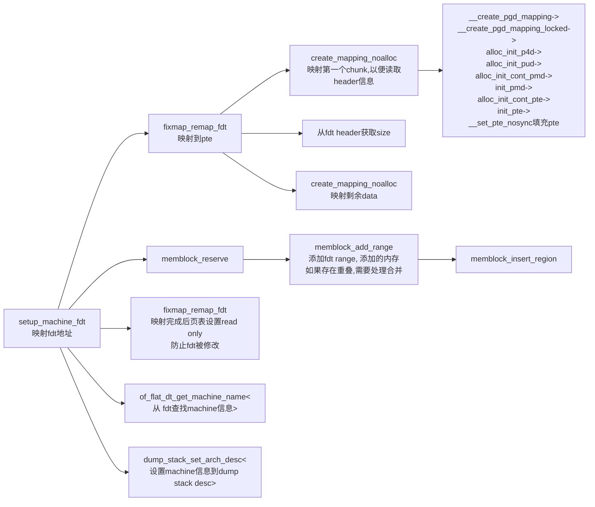
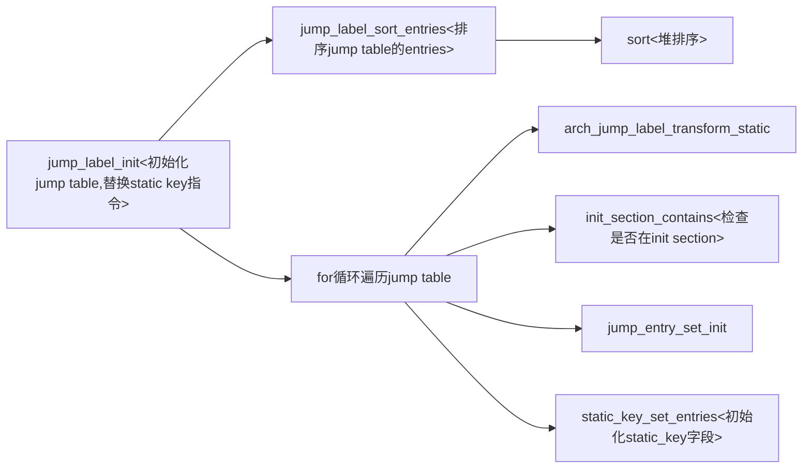
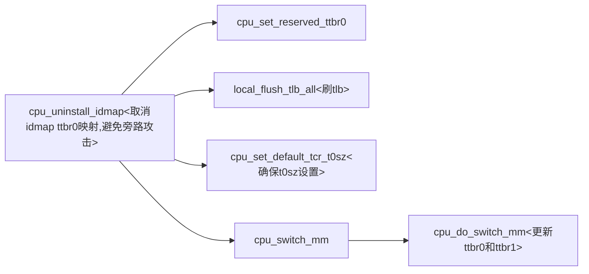
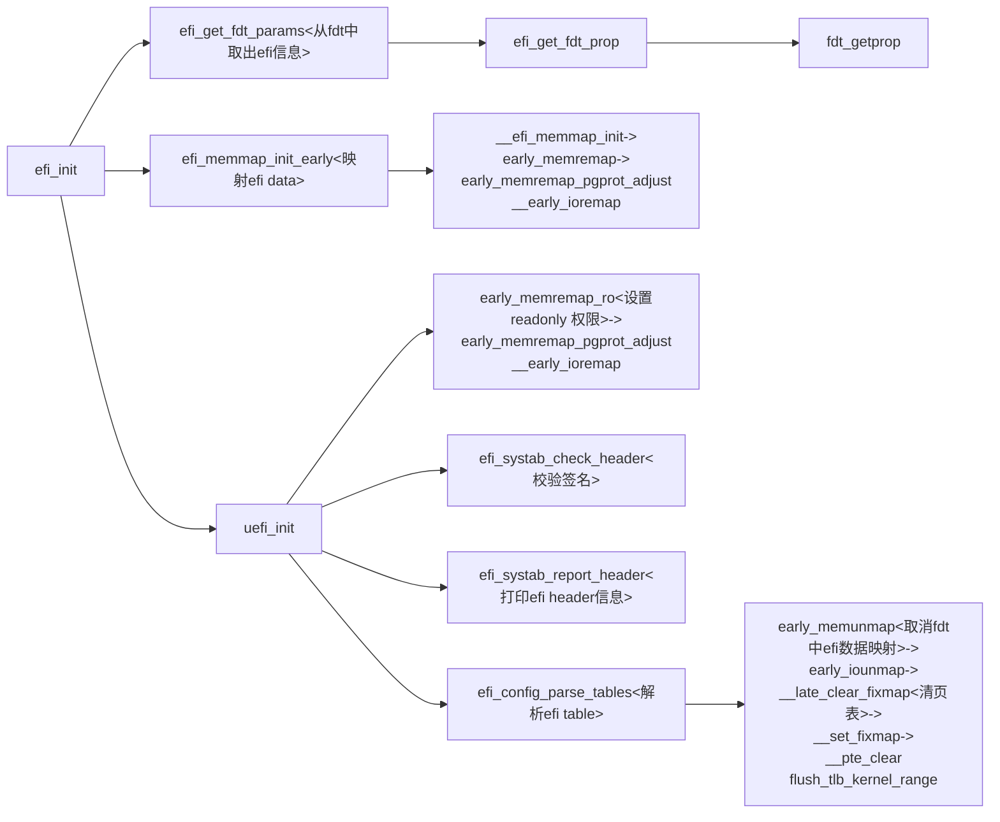
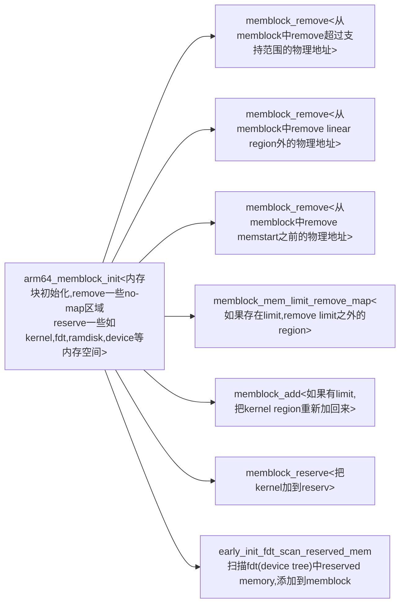
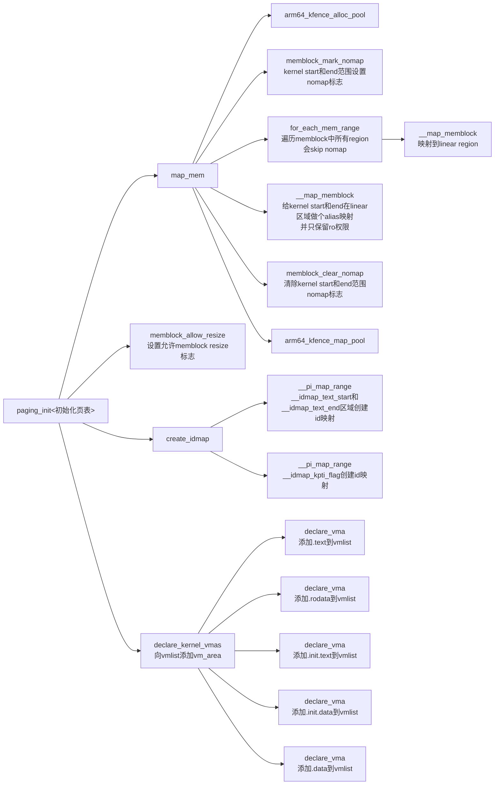

# start_kernel流程

## start kernel流程概览

由head.S跳转到start_kernel函数开始执行内核初始化流程：

## setup_arch 流程

### early_fixmap_init 流程

### setup_machine_fdt 流程

### jump label初始化流程

### cpu uninstall idmap流程

### efi init 流程

### arm64 memblock init流程

### paging_init流程

